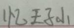
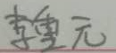
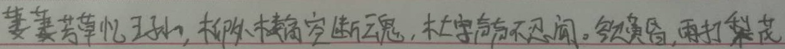
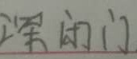
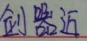
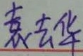
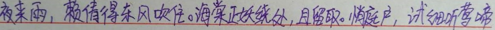
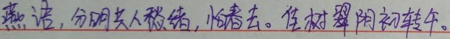
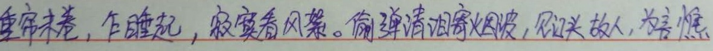
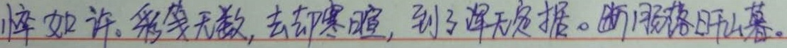

# CRNN(CNN+RNN+CTCLoss)

# 如何去测试

1.向test_data中添加需要测试的图片

2.模型下载地址：链接：https://pan.baidu.com/s/1Vf67fCPIMoFjUqcbVRD9Mw 提取码：abab 

解压到根目录下

3.运行模型

    python3 test_crnn.py

 4.结果显示在char_test.txt文件中

# 如何去train
1.处理train 数据集

    python3 ./utils/make_data.py

2.训练网络
    

    python3 train.py   

​    
| Prediction 	| Image 	|
|------------	|-------	|
| 忆王子山 	|  	|
| 李重元 	|  	|
| 萋萋芳草忆王孙。柳楼空断魂，未字声昏不无闲。欲黄昏，雨打我花 |  	|
| “闲门】 |  	|
| 剑熊近 |  	|
| 袁去华 |  	|
| 夜来雨，赖倚得东风吹住。海棠正娥绕处，且留取。悄庭户，试细听莺啼 |  	|
| 燕，分明共人愁绪，怕春去。佳树翠阴初转年。 |  	|
| 重帘未卷，乍睡起，寂寞看风絮。偷弹清泪寄烟波，欲头故，为言憔 |  	|
| 悴如许。彩笺无数，去却寒腰，到了深无是携。断月落日山暮。 |  	|
# Handwritten-text-recognition
# Handwritten-text-recognition
